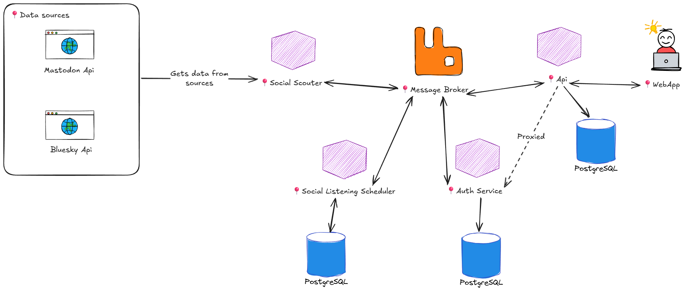

# Whisprr

- [Whisprr](#whisprr)
  - [Goal](#goal)
  - [Remarks](#remarks)
  - [Features](#features)
  - [Progress](#progress)
  - [How to run for development](#how-to-run-for-development)
  - [Architecture](#architecture)
    - [Microservice Architecture](#microservice-architecture)
      - [Tech Stack](#tech-stack)
      - [Entities](#entities)
        - [User](#user)
        - [Data Source](#data-source)
        - [Social Topic](#social-topic)
        - [Social Info](#social-info)
        - [Social Listening Task](#social-listening-task)
      - [Libraries](#libraries)
        - [Whisprr.BlueskyService](#whisprrblueskyservice)
        - [Whisprr.MastodonService](#whisprrmastodonservice)
        - [Whisprr.Caching](#whisprrcaching)
        - [Whisprr.Utils](#whisprrutils)
        - [Whisprr.Contracts](#whisprrcontracts)
        - [Whisprr.MessageBroker](#whisprrmessagebroker)
      - [Services](#services)
        - [Whisprr.SocialScouter](#whisprrsocialscouter)
        - [Whisprr.SocialListeningScheduler](#whisprrsociallisteningscheduler)
        - [Whisprr.AuthService](#whisprrauthservice)
        - [Whisprr.Api](#whisprrapi)
      - [Apps](#apps)
        - [whisprr-web-app](#whisprr-web-app)
    - [Publisher/Consumer Patterns](#publisherconsumer-patterns)
      - [MassTransit and RabbitMQ](#masstransit-and-rabbitmq)
      - [Channels](#channels)
    - [Logical bottlenecks for rate limits](#logical-bottlenecks-for-rate-limits)
      - [SempahoreSlim](#sempahoreslim)
      - [AddRateLimiter](#addratelimiter)
    - [JWT Authentication](#jwt-authentication)
    - [Realtime updates with Websockets and SignalR](#realtime-updates-with-websockets-and-signalr)
  - [Todos](#todos)

A social listening app built with microservice architecture and publisher/consumer pattern. This is an improved version of
the [distributed monolith version](https://github.com/ElysMaldov/WhisprrDistributedMonolith).

## Goal

I've mostly worked with monoliths/distributed monoliths and polyrepo code management.
With this project, I aim to learn more "pure" microservice architecture where each service is very decoupled by having
their own databases and storing their own data as needed. The services communicate with eachother
using a message broker. Another aim of this project is to know how much C# and .NET I could
learn and apply in limited time.

## Remarks

I haven't completed this project fully but I got the services to talk with one another
using message broker and users are able to register/login through the frontend. I got to say,
working with .NET and C# is actually really fun and structured! There's a lot of
resources about the concepts on the internet and a lot of ways to optimize my code that are
reocommended by my IDE (e.g. avoid inling loggers to avoid boxing/unboxing).

Compared to javacript monorepos like Turborepo, I really appreciate how there's a lot
of templates already pre-made for me to use and spin up projects in 1 repository quickly.
It's also really easy to share code. Alot of libraries are already provided that
handles my needs in a clean way, such as adding auth without changing my controller's code or, especially,
MassTransit and Channels for really easy publish/consume pattern with backpressure handling.

Overall I really liked working with .NET and C#. Even though the OOP paradigm forces
me to invest more time planning at the start, it makes my code much easier to maintain and
extend in the future. I was really happy about how I implemented [ISocialListener](services/Whisprr.SocialScouter/Modules/SocialListener/ISocialListener.cs), by using abstarct classes and template method pattern, I was able to integrate
Bluesky and Mastodon APIs to fetch social media posts by just creating a concrete class and
overidding a few properties and methods, and no regression happened.

## Features
The main feature of this app is users are able to listen to specific keywords and the
program will periodically aggregate data from multiple distributed social media
platforms to showcase to the user in real-time using SignalR.

This project takes inspiration from similar social listening apps such as [Brand24](https://brand24.com/).

## Progress
- Background data aggregation from Bluesky and Mastodon API is working through SocialScouter and SocialListeningScheduler services.
- Simple containers deployment through [docker compose](docker-compose.dev.yaml).
- JWT authentication through AuthService, which the Api proxies to for the WebApp.
- Services talking with eachother using MassTransit and RabbitMQ through the MessageBroker library.

## How to run for development
1. Run [docker compose dev](docker-compose.dev.yaml) to setup Postgres, REdis, and RabbitMQ
2. For Api, AuthService, and SocialListeningScheduler services; cd into them and apply migrations to your database using `dotnet ef database update`.
3. Run every service either using [VS Code's launch configuration](.vscode/launch.json), the CLI, or Visual Studio. The order of activation does not matter.
4. Run the React's whisprr-web-app using  `pnpm install` first then `pnpm dev`.

## Architecture

### Microservice Architecture
This project is built using microservice architecture. Each service has their own bounded context,
this means they manage their own domain logic and models. Every service have their own storage, such as
having their own Postgres databases on a single Postgres instance, this promotes logical separation.

There is no shared data, each service must define their own models for any entities it requires
to run. The main benefit of this is that each service can optimize their own data storage
by keeping only what is needed. This means each service **MUST** implement their own domain model.
Even if a domain model looks the same for multiple service, there **MUST** not be any shared
domain model files. This means services who need to persist data can do it on their own way (e.g. using
Postgres or another database), or maybe a service can work even without storing any data but just consuming
any incoming messages from the message broker.

However, to actually "share" data, this project utilizes event-driven architecture using MassTransit
and RabbitMQ. Each service can either publish or consume contracts. Contracts are basic records
containing detailed data about an event, such as a SocialListeningTask has finished or a User
has just been created. These contracts are published to the message broker and the consuming service
can consume those contracts to either run logic or persist the data in their own database. The contracts
classes are published as a shared class library for each service project to publish/consume.

Most services does not know about each other and they communicate using contracts through
the message broker. This promotes loose coupling. There are special cases such as
the Api that proxies authentication requests to Auth Service. Even then, authorization is
handled through JWT so each service can validate the tokens by themselves.

#### Tech Stack
- .NET
- SignalR
- MassTransit
- RabbitMQ
- PostgreSQL
- EF Core
- React

#### Entities
This project has certain entities that are modeled through contracts or each service domain models.
These entities are abstract concepts and are implemented indirectly through different contracts/domain
model classes instead of an explicit class for each entity. These abstract concepts help in modelling
contracts publish to the message broker and each service's domain models.

##### User
Describes a client user that are provisioned JWT tokens to access the program.

##### Data Source
A data source describes something like a social media platform (e.g. Bluesky or Mastodon)
where the program will fetch and aggregate data from to be available in the program.

##### Social Topic
Describes keywords that users can subscribe to and will be used to fetch specific social
media posts from data sources. E.g. a "Cooking recipe" topic means the program will fetch
social media posts containing the keywords "Cooking recipe", agregate it, and make it available
to the program and users.

##### Social Info
A social media post that has been fetched and aggregated from data sources and is availble
in the program.

##### Social Listening Task
A **command** to execute the actual social listening logic which would fetch and aggregate data
from data sources and turn them into social infos.

#### Libraries
This program provides custom class libraries available in the `lib/` folder.

##### Whisprr.BlueskyService
Abstracts querying posts from Bluesky API and provide access such as auth sessions.

##### Whisprr.MastodonService
Abstracts querying posts from Mastodon API.

##### Whisprr.Caching
Provides abstractions to cache data into any storage, such as Redis. Helpful to store authentication credentials for the services or implement write-behind pattern if the traffic increases.

##### Whisprr.Utils
Provides common utility classes or interfaces.

##### Whisprr.Contracts
Provides records that are used with `Whisprr.MessageBroker` to be published or consumed by services. Contracts are divided into 2:
1. Commands: contracts that are consumed by only 1 service and can be published by multiple sources to trigger a service's logic.
2. Events: contracts that are published and consumed by many services, mainly used to syncrhonize data after something happened or trigger a side-effect in a service.

##### Whisprr.MessageBroker
Provides MassTransit set up for each service to publish/consume contracts provided by the `Whisprr.Contracts` library.

#### Services
Services composes the core logic of the program, divided into seperate microservices for better seperation of concerns.

##### Whisprr.SocialScouter
A background worker that consumes [StartSocialListeningTask](lib/Whisprr.Contracts/Commands/StartSocialListeningTask.cs) to run multiple [SocialListeners](services/Whisprr.SocialScouter/Modules/SocialListener/ISocialListener.cs).

Internally, it utilizes bounded Channels to handle backpressure when too much StartSocialListeningTask messages comes from the MessageBroker By utilizing channels, this service can be extended to trigger from multiple sources as long as it writes the task to the channels.

To fetch social info, this service consumes a StartSocialListeningTask and run the appropiate SocialListener based on that task's platform type.

This service produces:
- [SocialInfoCreated](lib/Whisprr.Contracts/Events/SocialInfoCreated.cs): this service does not persist data, but any fetched social info will be published to the message broker to be persisted by the other services.
- [SocialListeningTaskQueued](lib/Whisprr.Contracts/Events/SocialListeningTaskQueued.cs): an event where a task is queued to be executed by a SocialListener.
- [SocialListeningTaskProgressed](lib/Whisprr.Contracts/Events/SocialListeningTaskProgressed.cs): an event when a SocialListener has progressed with a task (e.g. founding X posts from Y source), useful to impllement a realtime loading indicator on the frontend.
- [SocialListeningTaskFailed](lib/Whisprr.Contracts/Events/SocialListeningTaskFailed.cs): an event where a task fails.
- [SocialListeningTaskFinished](lib/Whisprr.Contracts/Events/SocialListeningTaskFinished.cs): an event where a task successfully finishes.

##### Whisprr.SocialListeningScheduler
A web API service that utilizes Hangfire to run a cron job to execute `Whisprr.SocialScouter`. To implement this, this service persists data about all the social topics made by any users and create multiple tasks for each data source. So if the program has 2 social listeners: Bluesky and Mastodon, 1 topic will be turned into 2 task, each to run a social listener for a specific platform.

Once the scheduler has created the tasks, it will store it in its postgres first before publishing to the message broker by utilizing transactional outbox pattern.
This means the task record MUST be successfully saved to its database first before being sent to the message broker.
If the message fails to send, the database will roll-back.
This method ensures writing to database and sending the event is done atomically.

With Hangfire, you can access the `/hangfire` endpoint on this service to access the dashboard and see details about available recurring jobs.

##### Whisprr.AuthService
A service that provides REST Apis where other services can proxy to and allow users to register/login using JWT and refresh tokens.
It returns JWT to be persisted by the clients and validated separately on each service.

This service produces:
- [UserCreated](lib/Whisprr.Contracts/Events/UserCreated.cs): an event containing a newly created user data.
- [UserLoggedIn](lib/Whisprr.Contracts/Events/UserLoggedIn.cs): an event indicating a user has just logged in.

##### Whisprr.Api
A REST Api that provides external client access to specific parts of the system and acts as the BFF for the whisprr-web-app and any other clients.

It provides endpoints for users to login/register by proxying into the AuthService, subscribing to certain topics, querying collected social info, and providing SignalR websocket to automatically update clients when a new social info is generated by the system.

It consumes multiple events to build its own data, such as:
- [SocialInfoCreated](lib/Whisprr.Contracts/Events/SocialInfoCreated.cs).
- [SocialListeningTaskQueued](lib/Whisprr.Contracts/Events/SocialListeningTaskQueued.cs).
- [SocialListeningTaskProgressed](lib/Whisprr.Contracts/Events/SocialListeningTaskProgressed.cs).
- [SocialListeningTaskFailed](lib/Whisprr.Contracts/Events/SocialListeningTaskFailed.cs).
- [SocialListeningTaskFinished](lib/Whisprr.Contracts/Events/SocialListeningTaskFinished.cs)

For each of those events it consumes, it'll map it into this service's own domain model and store it to its own database using EF Core.

This service produces:
- [SocialTopicCreated](lib/Whisprr.Contracts/Events/SocialTopicCreated.cs): an event that publishes when a user listens to a social topic that is not available in the system yet.

For the user data, this service doesn't store the hashed password, instead it just store user details data to be shown to the frontend and the credentials are stored in the AuthService database.

#### Apps

##### whisprr-web-app
A React + Vite app built with TypeScript and Tanstack Router. It provides clients the UI to interact with our program to login/register and subscribe to specific topics the user wants to be updated on. It utilizes the SignalR client to provide realtime updates when new social info are collected by the system.

### Publisher/Consumer Patterns
This program heavily relies on the publisher/consumer pattern on multiple parts to make the system reactive and event-driven.

#### MassTransit and RabbitMQ
The "central" publisher/consumer pattern that are applied at the architecture level is implement using MassTransit and RabbitMQ. MassTransit abstracts away the dirty details of RabbitMQ and provides an easy way for our services to publish/consume contracts.

#### Channels
Some services such as the SocialScouter utilizes bounded Channels to execute the social listeners in a reactive way. Channels are implemented to seperate the actual social listening logic and how to execute it when multiple sources wants to trigger the social listener. As of now, only when a task is created and consumed by this service, will it write to the task channel to activate the appropiate social listener.

However, in the future there can be many other sources that writes to the channel and trigger it in other ways such as a background cron job. Bounded channels are used to handle backpressure if the system scales too much that it triggers more tasks than the listeners can consume.

### Logical bottlenecks for rate limits
#### SempahoreSlim
`SemaphoreSlim` is utilized in [BlueskyAuthService](lib/Whisprr.BlueskyService/Modules/BlueskyAuthService/BlueskyAuthService.cs) to prevent duplicate 401 requests to run unnecessary multiple refresh token requests. It limits only the first request that fails to refresh the token and update it for the other requests that are paused.

#### AddRateLimiter
Using Polly and the Resilience library, the BlueskyService and MastodonService are rate limitted with a small queue window to prevent abusing the platform's Apis.

### JWT Authentication
The AuthService provides endpoints to register and login to provison JWT tokens. However, each service must be responsible in authorizing these tokens by themselves to avoid tight coupling with the AuthService. In the future, there should be a class library to uniformly encode/decode the JWT produced by the AuthService.

### Realtime updates with Websockets and SignalR
The Api service provides websockets through SignalR so the frontend client can update the UI in realtime. This gives a nicer user experience.

## Todos
- [ ] Implement users subcribing to social topics
- [ ] Integrate realtime updates for social topic in the users dashboard
- [ ] Implement unit, integration, and e2e testing